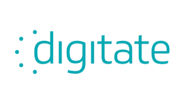
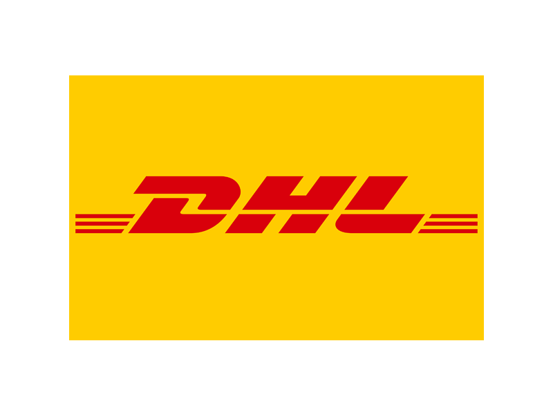

I am a Senior Software Engineer in the field of Information Technology and Robotics, currently living in Cincinnati, Ohio. I did my Master of Engineering in Aerospace Engineering from University of Cincinnati. I am huge fan of Aritificial Intelligence, Robotics, Data Engineering and Autonomous vehicles (drones and cars)

### Past Clients

<!--more-->

    
    
    
    
    
    
    
    
    
    
    
    
    
    
    
    

## Early life
I am orginally from Erode, Tamilnadu, India. I completed my primary and secordary school education at Navarasam Matriculation Higher Secondary School, Erode. Due to my passion towards engineering, especially Aerospace, I joined Rajalakshmi Engineering College, Chennai.

After getting my Bachelor degree in Aeronautical Engineering, I joined Tata Consultancy Services, Chennai as Software Developer.

Due to my appetite towards higher education and continous learning, after three years of work experience, I applied to University of Cincinnati.

## Life in United States
I moved to Cincinnati, US in 2017. I completed my graduate program at University of cincinnati. During this program, I did internship at Intelligence Maintenance systems lab, under College of Engineering and Applied Science, UC. During this experience, I worked with MAZAK, a japanese CNC manufacturing company, to develop machine failure prediction systems using AI.

Post my graduation, I rejoined TCS, Farmington hills as Solution Architect. During this work, I got chance to work directly with Fortune companies including Mercedes Benz Financial Services, Belk, Toyota Motors North America and Astellas Pharma. This experience enabled me to work on software solutions for various domains such as Automobiles, Retail and Pharmaceuticals.

After 2 years of experience at TCS, I joined Thordrive Inc, a startup based out of Cincinnati. I joined there as Perception Engineer and worked on perception stack for autonomous tracter. Here, I got chance to work on some of the cutting edge algorithms in the self-driving vehicles. I also worked on Data team, as Lead Data Engineer. I helped them design and develop complete data pipelines for autonomous vehicles. This includes developing features such as handling petabytes of data, data collection of LIDAR, RGB Camera, Thermal Camera & Vehicle logs, data storage in AWS, data visualization, data sampling, data annotation, data clipping, data sync, data validation, data retention policy, data security and reporting.

## Current Situation 
I am currently working with Agtonomy, an Agtech Roboticscompany. 

## Past Clients

    
    
    
    
    
    
    
    
    
    
    
    
    
    
    
    

 
<h2>Contact</h2>

  
    
    <a href="mailto:chandrkm@mail.uc.edu">chandrkm@mail.uc.edu</a>

    
    <a href="https://linkedin.com/in/krish-na">LinkedIn</a>

    
    <a href="https://github.com/krishna-chandran">GitHub</a>

